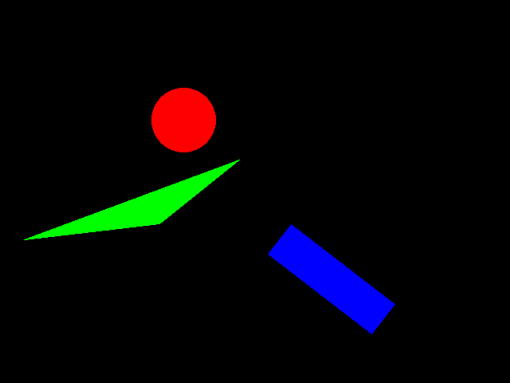
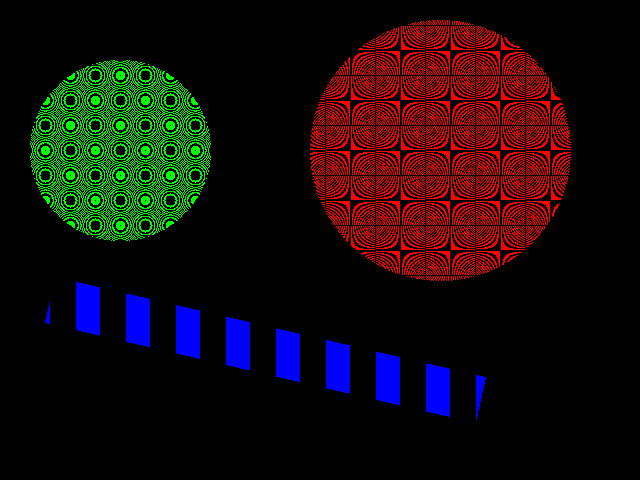
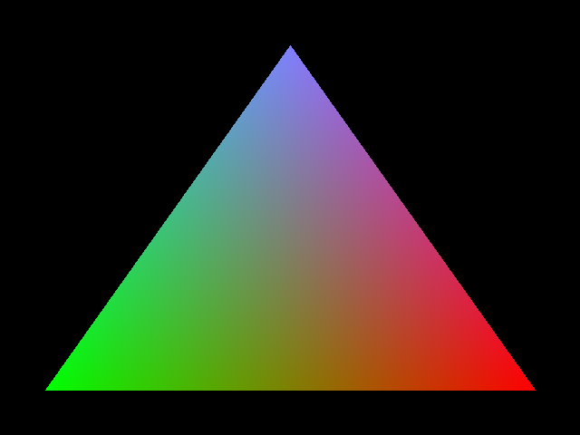

# Shapes

This is a little project i made to learn something about graphics programming. It contains algorithms for drawing lines, circles, triangles and rectangles.
All algorithms work only with integer arithmetic ([bresenham's algorithm](https://en.wikipedia.org/wiki/Bresenham%27s_line_algorithm)).

The library makes heavy use of dlang's ranges. They are used in the internal implementation and also for the API.
A shape in this library is just a lazily calculated sequence (dlang's range) of points. This makes it very composable and you can use dlang's standard library to
easily create visual effects. The following examples will show this...

If you want to know more about dlang's ranges i recommend this [article](https://www.informit.com/articles/printerfriendly/1407357) by Andrei Alexandrescu.
The new c++20 ranges library was inspired by dlang's ranges. If you struggle to understand the use of c++ ranges this might help you, because there is a less noise than in the c++ version.

## Examples

### Example 1 - Surface

A surface represents a 2 dimensional screen. We can use clear to set all pixels to one value and 2 dimensional indexing to access individual pixels.
After drawind something we can safe the genearted image to a bmp file.

```D
import shapes;

void main()
{
    int width = 640;
    int height = 480;
    Surface surface = Surface(width, height);
    surface.clear(0x3F3F3FFF);

    for (int i = 0; i < 640; i++)
        surface[i, i/2] = 0xFF000000;

    surface.toBmp("test.bmp");
}
```

### Example 2 - Basics

For the next example we need to know 2 structs. A "Point" consists of a x- and y-Coordinate. A "Pixel" consists of a "Point" and a color (32bit RGBA).
The function circle gives us a range of all the points of the circle. The method surface.put() expects a range of pixels. To transform a range of points into a range of pixels
we can use the map function. In case of a planly colored shape this is very simple. The triangle example shows, that you can also use a tuple instead of the pixel struct.

```D
import std.range;
import std.algorithm;
import std.typecons;
import shapes;

void main()
{
    int width = 640;
    int height = 480;
    Surface surface = Surface(width, height);
    surface.clear;

    surface.put(
        circle(Point(230, 150), 40)
        .map!(a => Pixel(a, 0xFF0000FF)));

    surface.put(
        triangle(Point(30, 300), Point(300, 200), Point(200, 280))
        .map!(a => a.asTuple ~ tuple!("color")(0x00FF00FF)));

    surface.put(
        line(Point(350, 300), Point(480, 400), 50)
        .map!(a => Pixel(a, 0x0000FFFF)));

    surface.toBmp("test.bmp");
}
```


### Example 3 - Filter

We can create patterns by only only drawing some of the points. For this we use dlang's filter function.

```D
import std.range;
import std.algorithm;
import std.typecons;
import std.math;
import shapes;

void main()
{
    int width = 640;
    int height = 480;
    Surface surface = Surface(width, height);
    surface.clear;

    surface.put(
        line(Point(50, 300), Point(480, 400), 50)
        .filter!(a => a.x % 50 > 25)
        .map!(a => Pixel(a, 0x0000FFFF)));

    surface.put(
        circle(Point(440, 150), 130)
        .filter!(a => a.x * a.y % 50 > 25)
        .map!(a => Pixel(a, 0xFF0000FF)));

    surface.put(
        circle(Point(120, 150), 90)
        .filter!(a => (abs(120 - a.x)^^2 + abs(150 - a.y)^^2) % 50 > 25)
        .map!(a => Pixel(a, 0x00FF00FF)));

    surface.toBmp("test.bmp");
}
```



### Example 4 - Triangle

We can make the classic triangle example shown in every introduction about shader programming. For this we need a helper function to add information about
the relative position of a point inside the triangle. For example a value of 0.0, 0.0 will mean the top left point of the triangle and a value of 1.0, 1.0 is the point at
the bottom right.

We use again map to return a range with the additional information.

```D
auto normalize(R)(R shape, int xMin, int xMax, int yMin, int yMax)
{
    import std.typecons : tuple;
    import std.algorithm : map;
    return shape.map!(a => tuple!("x", "y", "xNorm", "yNorm")
                      (a.x, a.y, norm(a.x, xMin, xMax), norm(a.y, yMin, yMax)));
}
```

Now we can increase the intesity of red when going to the right, green to the left and blue to the top.

```D
import std.range;
import std.algorithm;
import std.typecons;
import shapes;

void main()
{
    int width = 640;
    int height = 480;
    Surface surface = Surface(width, height);
    surface.clear;

    surface.put(triangle(Point(320, 50), Point(50, 430), Point(590, 430))
                .normalize(50, 590, 50, 430)
                .map!(a => a ~ tuple!("color")(Color(a.xNorm, 1-a.xNorm, 1-a.yNorm))));

    surface.toBmp("test.bmp");
}
```

